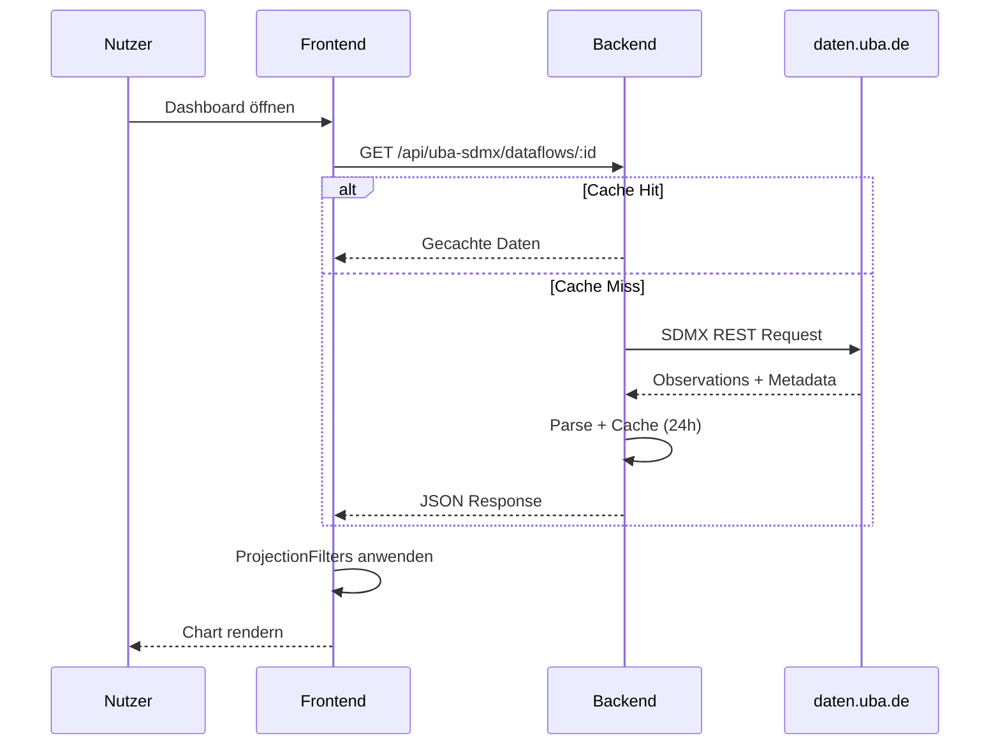

# 16 – Abbildungs- und Tabellenvorschläge

Vorschläge für Diagramme und Tabellen im finalen wissenschaftlichen Bericht.

---

## Abbildungen (Diagramme)

### Abb. 1: Systemkontext (C4 Level 1)

**Typ:** Kontextdiagramm  
**Inhalt:** UBA Dashboarding im Zentrum, verbunden mit: Nutzer (Public/Author/Admin), UBA SDMX API, UBA Data Cube, MongoDB, Azure Hosting  
**Quelle:** Kapitel 03, 06

```
┌──────────┐     ┌─────────────────────┐     ┌──────────────┐
│  Nutzer  │────▶│ UBA Dashboarding    │────▶│ daten.uba.de │
│ (Browser)│     │ (Frontend+Backend)  │     │ (SDMX API)   │
└──────────┘     └──────────┬──────────┘     └──────────────┘
                              │
                    ┌─────────┼─────────┐
                    ▼         ▼         ▼
              ┌─────────┐ ┌───────┐ ┌──────────┐
              │ MongoDB │ │ Azure │ │ Data Cube│
              └─────────┘ └───────┘ └──────────┘
```

---

### Abb. 2: Schichtenarchitektur Frontend

**Typ:** Schichtendiagramm  
**Inhalt:** UI → Controller → Services → Stores → HTTP  
**Quelle:** Kapitel 04, `docs/architecture.md`

---

### Abb. 3: Editor vs. App-Trennung

**Typ:** Komponentendiagramm  
**Inhalt:** RootStoreApp (Pages) vs. RootStoreEditor (Editor), Lazy Loading Boundary  
**Quelle:** Kapitel 04, 08

---

### Abb. 4: SDMX-Datenfluss

**Typ:** Sequenzdiagramm  
**Inhalt:** Nutzer → Frontend → Backend Proxy → daten.uba.de → Cache → Projection → Chart  
**Quelle:** Kapitel 06



---

### Abb. 5: Filter-Architektur (Brushing & Linking)

**Typ:** Flussdiagramm  
**Inhalt:** Bar-Chart-Selektion → FilterStore → ProjectionFilters → andere Tiles  
**Quelle:** Kapitel 07

---

### Abb. 6: Tile-Registry (Plugin-Modell)

**Typ:** Klassendiagramm (vereinfacht)  
**Inhalt:** ElementRegistry → Definition → Store/Renderer/Panel  
**Quelle:** Kapitel 08

---

### Abb. 7: Sicherheitsschichten (Defense-in-Depth)

**Typ:** Schichten-/Onion-Diagramm  
**Inhalt:** HTTPS → Rate Limit → Session → CSRF → Validation → RBAC  
**Quelle:** Kapitel 09

---

### Abb. 8: Deployment-Architektur Azure

**Typ:** Infrastrukturdiagramm  
**Inhalt:** GitHub → CI/CD → Azure SWA + Web App → MongoDB  
**Quelle:** Kapitel 12

---

### Abb. 9: Docker Compose Topologie (Production)

**Typ:** Container-Diagramm  
**Inhalt:** frontend, backend, user-docs, mongo, mongo-backup, Reverse-Proxy  
**Quelle:** Kapitel 12, `docs/deployment.md`

---

## Tabellen

### Tab. 1: Technologie-Stack

| Schicht | Technologie | Version |
|---------|-------------|---------|
| Frontend | React, TypeScript, Vite, MobX, Mantine | 19, 5.8, 6, 6, 7 |
| Backend | Node.js, Express, Mongoose | ≥20, 4, 8 |
| Datenbank | MongoDB | 7 |
| Charts | Plotly.js | – |
| Tests | Vitest, Jest | – |
| Docs | VitePress | 1.6 |
| Hosting | Azure SWA, Web App | – |

**Quelle:** Anhang A

---

### Tab. 2: Benutzerrollen und Berechtigungen

| Rolle | Anzeigen | Bearbeiten | Erstellen | Veröffentlichen | Admin |
|-------|----------|------------|-----------|-----------------|-------|
| Public | ✅ (published) | ❌ | ❌ | ❌ | ❌ |
| Reviewer | ✅ (alle) | ❌ | ❌ | ❌ | ❌ |
| Author | ✅ | ✅ (eigene) | ✅ | ✅ | ❌ |
| Admin | ✅ | ✅ (alle) | ✅ | ✅ | ✅ |

**Quelle:** Anhang C

---

### Tab. 3: Tile-Typen

| Typ | Datengebunden | Interaktiv | Default-Größe |
|-----|---------------|------------|---------------|
| barChart | ✅ | ✅ | 6×6 |
| donutChart | ✅ | – | – |
| kpiTile | ✅ | – | – |
| yearPicker | – | ✅ | – |
| legend | – | – | – |
| intro | – | – | – |
| textTile | – | – | – |
| linkTile | – | – | – |
| button | – | ✅ | – |

**Quelle:** Anhang D

---

### Tab. 4: REST-API-Endpunkte (Kurz)

| Prefix | Endpunkte | Auth |
|--------|-----------|------|
| /api/auth | login, logout, users, csrf | Gemischt |
| /api/dashboards | CRUD, publish, duplicate | Author+ |
| /api/uba-sdmx | dataflows, cache | Öffentlich/Admin |
| /api/images | upload, get, thumbnail | Author/Öffentlich |
| /api/tags | CRUD, available | Admin/Auth |
| /api/cta-links | CRUD | Admin/Öffentlich |

**Quelle:** Anhang B

---

### Tab. 5: Sicherheitsmaßnahmen

| Maßnahme | Implementierung | Status |
|----------|-----------------|--------|
| CSRF | Double-Submit | ✅ |
| Rate Limiting | express-rate-limit | ✅ |
| Bcrypt | 12 Rounds | ✅ |
| NoSQL-Guard | isPlainString | ✅ |
| Bild-Re-Encode | sharp → JPEG | ✅ |
| helmet | HTTP-Headers | ✅ |
| SSO/2FA | – | ❌ |
| Audit-Log | – | ❌ |

**Quelle:** Kapitel 09

---

### Tab. 6: Testabdeckung

| Bereich | Tests | Framework |
|---------|-------|-----------|
| Frontend a11y | ~77 | Vitest + axe |
| Frontend Unit | ~26 | Vitest |
| Backend Unit | Mehrere Suites | Jest |
| Backend Integration | SDMX Crosscheck | Jest |
| E2E | 0 | – |

**Quelle:** Kapitel 11

---

### Tab. 7: Anforderungserfüllung

| Kategorie | Erfüllt | Teilweise | Offen |
|-----------|---------|-----------|-------|
| Dashboard-Editor | ✅ | – | – |
| SDMX-Integration | ✅ | – | – |
| Mehrsprachigkeit | ✅ | – | – |
| Barrierefreiheit | – | ✅ (axe) | Zertifizierung |
| Sicherheit | ✅ | – | SSO |
| E2E-Tests | – | – | ❌ |
| Versionierung | – | – | ❌ |

**Quelle:** Kapitel 02, 14

---

### Tab. 8: Designentscheidungen (Trade-offs)

| Entscheidung | Gewählt | Alternative | Hauptgrund |
|--------------|---------|-------------|------------|
| State | MobX | Redux | Reaktivität |
| DB | MongoDB | PostgreSQL | Flexibles Schema |
| Auth | Session | JWT | Invalidierung |
| SDMX | Proxy | Direkt | Caching |
| Architektur | Monolith | Microservices | Einfachheit |

**Quelle:** Kapitel 13

---

## Hinweise zur Erstellung

- Diagramme können mit **Mermaid**, **draw.io**, **PlantUML** oder **Figma** erstellt werden
- Screenshots aus `user-docs/public/screenshots/` für UI-Beispiele nutzen
- Für wissenschaftliche Berichte: einheitliche Nummerierung (Abb. X, Tab. X)
- Farben: UBA-Corporate-Design beachten (falls verfügbar)
